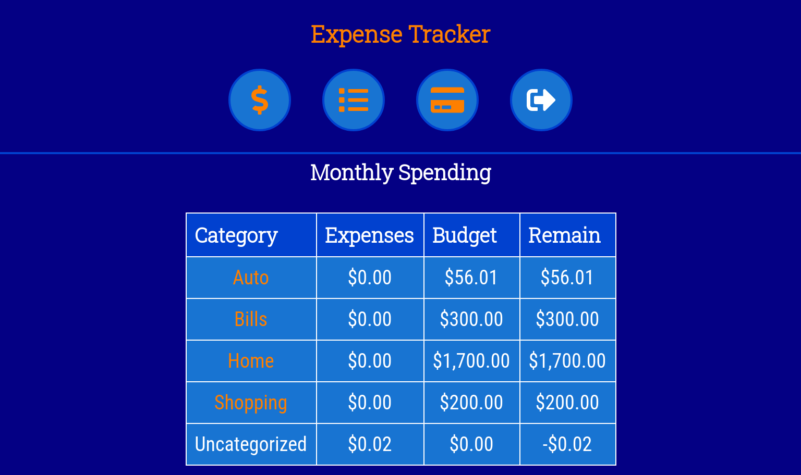
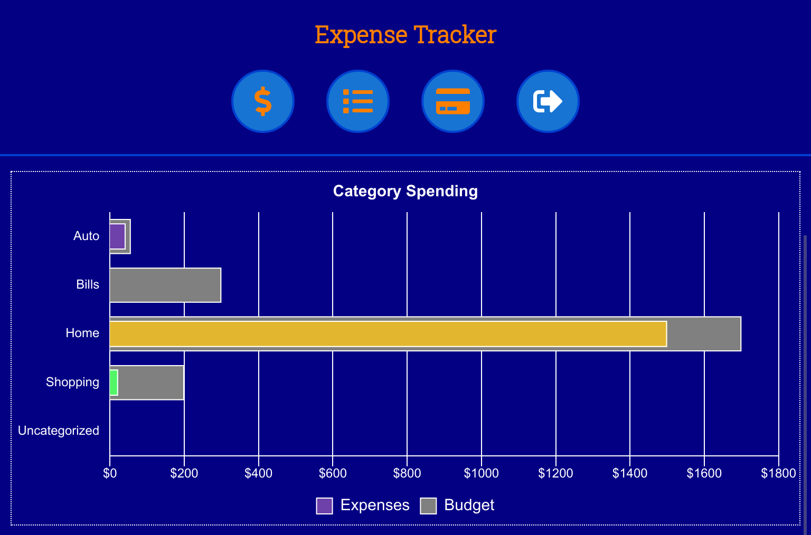

# [Expense Tracker](https://expense-tracker-client.vercel.app/)

You might ask yourself, where do I spend my money? Most people can think of big items like rent and car payments, but then it starts to get fuzzy. Did I buy pizza this week or last week? How much did I spend on groceries? **[Expense Tracker](https://expense-tracker-client.vercel.app/)** aims to help people track their spending by making it easy to add an expense and quickly see where money is being spent by category. You set the categories, you set the payment methods, then you start tracking.

With some expenses entered, a dashboard will present information about the current month (or recent months). This includes showing spending by category with budget expenses and remaining budget, some charts breaking down spending by category and payment methods over time. The emphasis is on keeping things simple, such that my wife would use it.

[Expense Tracker](https://expense-tracker-client.vercel.app/) is built using React for the frontend and Node/Express/PostgreSQL for the [backend](https://github.com/camdecoster/expense-tracker-api). Give it a try and let me know if you have any [feedback or suggestions](https://github.com/camdecoster/expense-tracker-client/issues) on the client.
